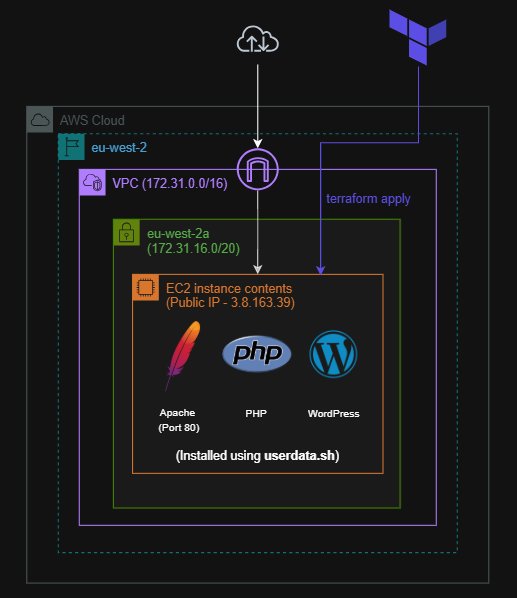
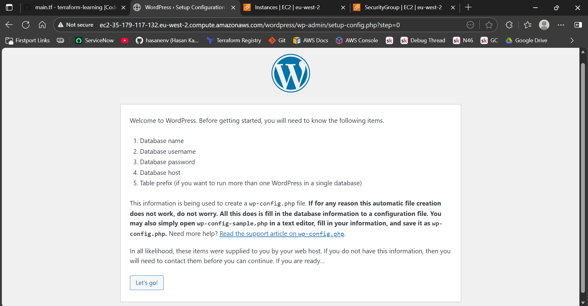

# Terraform WordPress Deployment on AWS EC2

  

This project uses Terraform to provision a full WordPress setup on AWS. It deploys an EC2 instance in a public subnet, installs Apache, PHP and WordPress through userdata, and exposes the site over HTTP using the instance’s public IP.

It’s a simple example of infrastructure as code in action, showing how Terraform can automate an end to end deployment with zero manual steps.

## Terraform Provisioned Resources

- EC2 instance running Apache, PHP and WordPress
- Default VPC with a public subnet selected for the instance
- Security group allowing inbound HTTP traffic on port 80
- Userdata script that installs and configures everything on boot
- Public IP assigned via Terraform

## How It Works

1. Terraform provisions an EC2 instance in the default VPC.
2. Userdata installs Apache, PHP and pulls down the WordPress files.
3. The instance gets a public IP so the site is reachable over the internet.
4. The security group allows inbound HTTP traffic from anywhere.
5. Once the instance boots, WordPress is ready through the public endpoint.

  

## Possible Next Steps/Considerations

- Expand the setup with HTTPS using ACM or self-signed certificates  
- Add a database in RDS or another EC2 instance to separate the WordPress backend  
- Experiment with multiple instances and load balancing for high availability  
